# Introduction

In a previous project, I scaled our tooling website by deploying three web servers behind a load balancer to distribute incoming traffic evenly. While manual configuration works for small setups, scaling to dozens or hundreds of servers introduces high risks of human error and operational friction. To ensure agile, rapid, and repeatable deployments, automation is essential. To solve this, I integrated Jenkins—an open-source automation server—into our pipeline to build a continuous integration and continuous delivery (CI/CD) workflow capable of managing application releases at scale.

## What is Continuous Integration (CI)?

Continuous Integration (CI) is a core DevOps practice where developers regularly merge small code updates into a shared repository—often multiple times a day. Every commit automatically triggers an automated build and test pipeline, catching bugs early and validating code quality before integration.

### Introduction to Jenkins
Automation is the backbone of DevOps, ensuring agility, repeatability, and scalability of deployments. In this project, we will set up a Jenkins CI/CD server to automate the deployment of the Tooling Website.
### The benefits of CI include:
   - Early detection of integration issues
   - Automated quality checks (build/test/lint)
   - Faster feedback cycles for developers
   - Increased release velocity and reliability
   

## Project Overview

In this project, we leveraged Jenkins CI capabilities to ensure that every change made to our source code in GitHub is automatically deployed to our tooling website.

We enhanced the architecture from Project 8 by introducing a Jenkins server that manages automated deployments.
🔑 Key Features Implemented
* Automated build pipeline with Jenkins CI
* GitHub → Jenkins → NFS → Web Servers workflow
* Secure SSH key-based authentication for artifact delivery
* Scalable design to support multiple web servers behind a load balancer

## Project Architecture
```
                ┌───────────────┐
                │   Developers  │
                └───────┬───────┘
                        │ (git push)
                        ▼
                ┌──────────────────┐
                │     GitHub Repo  │
                └────────┬─────────┘
                         │ (webhook)
                         ▼
                ┌──────────────────┐
                │   Jenkins Server │
                │ (CI/CD Pipeline) │
                └────────┬─────────┘
                         │ (SSH transfer)
                         ▼
                ┌──────────────────┐
                │     NFS Server   │
                │   (/mnt/apps)    │
                └────────┬─────────┘
                         │ (mounted storage)
     ┌───────────────────┼───────────────────┐
     ▼                   ▼                   ▼
┌──────────┐                          ┌──────────┐
│ WebSrv 1 │                          | WebSrv 2 |
└──────┬───┘                          └──────┬───┘
       │                  │                  │
       └──────────┬───────┴──────────┬───────┘
                  ▼                  ▼
           ┌────────────────────────────────┐
           │                                |
           |        Database Server         │
           │                                │
           └────────────────────────────────┘
```

## STEP-BY-STEP DEPLOYMENT GUIDE
Prerequisites

2 RHEL8 Web Servers (serving the application)
1 Ubuntu 24.04 MySQL Database Server
1 RHEL8 NFS Server
1 Ubuntu 24.04 Apache Load Balancer (LB)
Basic Knowledge – Linux CLI, Git, and systemd service management.

## Step 1 – Install Jenkins Server

### Create an EC2 Instance:

* Launch an Ubuntu Server 24.04 LTS EC2 instance.
* Name it: Jenkins.
* Instance type: t2.medium (recommended) — Jenkins requires more RAM than a t2.micro though can be used for testing
* Attach the correct security group to allow SSH and port 8080.
* SSH into the server: ssh -i <your-key>.pem ubuntu@<jenkins-public-ip> 

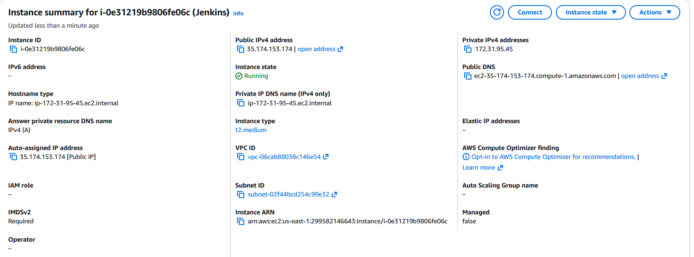 
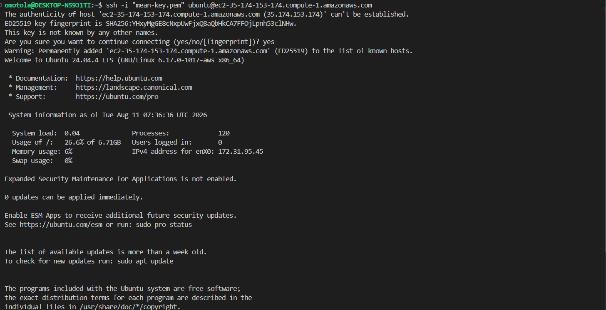

### Install Java JDK

Jenkins is a Java-based application, so we need Java installed.

```
sudo apt update
sudo apt install default-jdk-headless -y
```
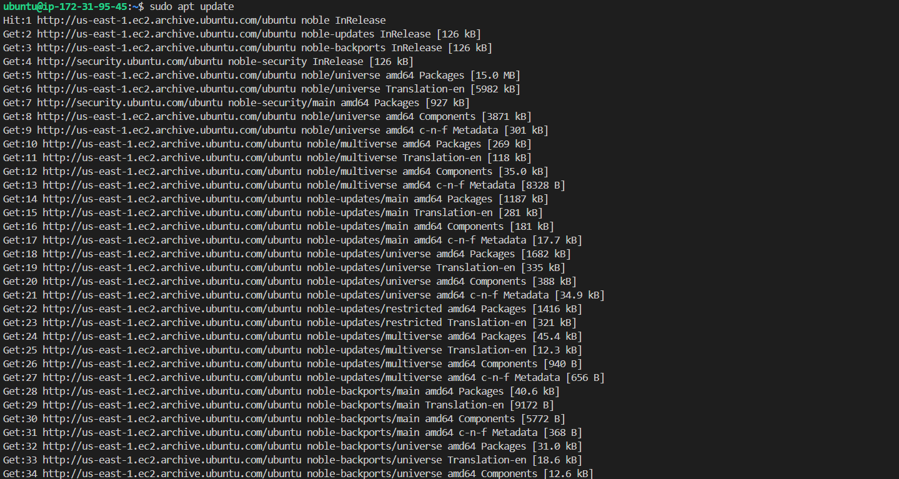
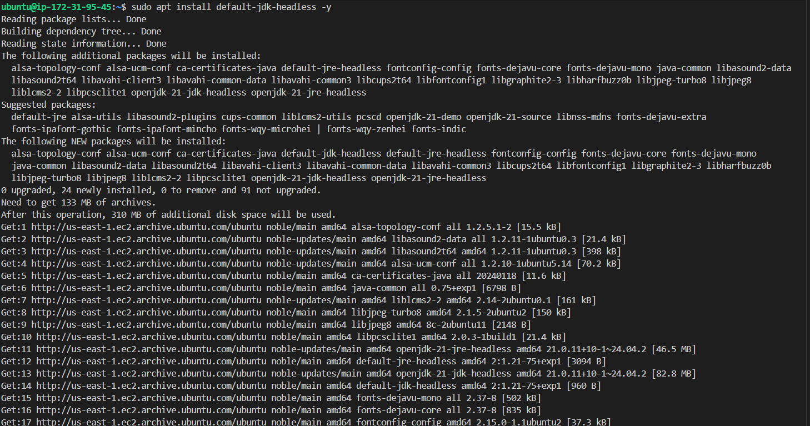 

default-jdk-headless installs Java without GUI libraries (lightweight for servers).

You can confirm installation:

```
java -version
```
### Install Jenkins

Install Jenkins from the official Jenkins Debian repository to ensure the latest stable version.

* Update system packages and install dependencies:

```
sudo apt update
sudo apt install -y openjdk-17-jre wget curl gnupg2
```

  + openjdk-17-jre ensures Java 17 runtime (supported by Jenkins).
  + wget, curl, gnupg2 are utilities for fetching and verifying packages. 
  
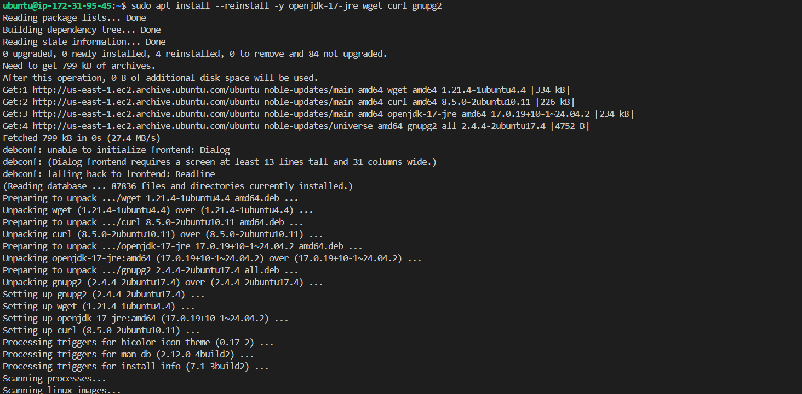

* Import the Jenkins GPG key (signed in 2026):

```
sudo wget -O /etc/apt/keyrings/jenkins-keyring.asc \
https://pkg.jenkins.io/debian-stable/jenkins.io-2026.key
```
Ensures the package is trusted and verified by Jenkins maintainers.

* Add Jenkins repository:

```
echo "deb [signed-by=/usr/share/keyrings/jenkins-keyring.asc] https://pkg.jenkins.io/debian-stable binary/" \
| sudo tee /etc/apt/sources.list.d/jenkins.list > /dev/null
```
This adds Jenkins repository under /etc/apt/sources.list.d/.

* Update package lists:

```
sudo apt update
```
* Install Jenkins:

```
sudo apt install -y jenkins
```
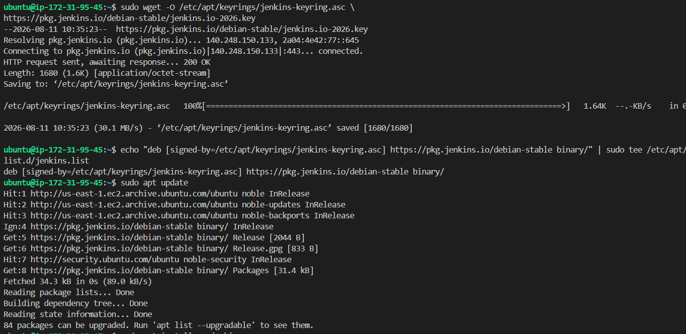
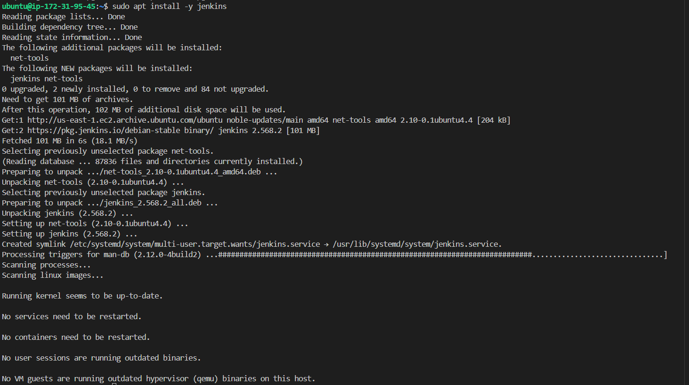

Installs Jenkins and creates a systemd service: /lib/systemd/system/jenkins.service.

* Enable and start Jenkins service:

```
sudo systemctl start jenkins
sudo systemctl enable jenkins
```

* Verify Jenkins status:

```
sudo systemctl status jenkins
```

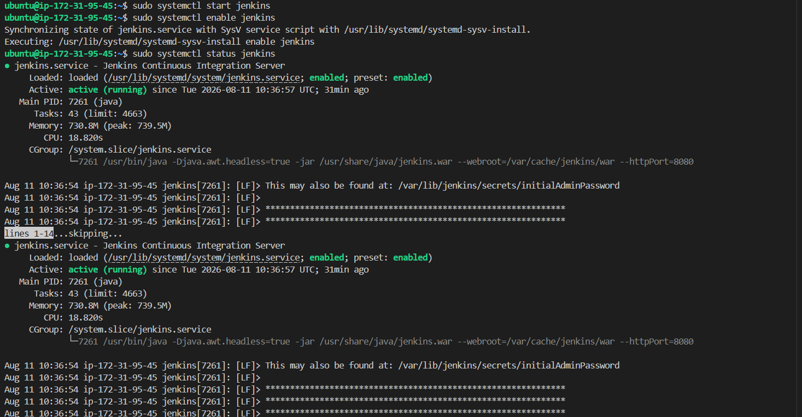 

If running, you should see: Active: active (running).

### Open Jenkins Port (8080)

By default, Jenkins runs on port 8080.
  
  * Go to your AWS Security Group attached to the Jenkins server.
  * Add an Inbound Rule:
  * Port Range: 8080
  * Source: My IP (or 0.0.0.0/0 for testing — less secure)

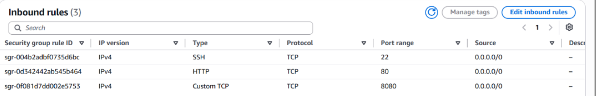
## Perform Initial Jenkins Setup

* Open Jenkins in your browser:

```
http://<jenkins-public-ip>:8080
```
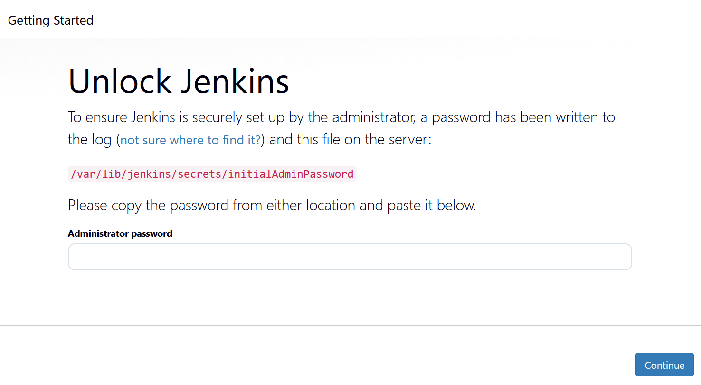

You’ll be prompted for the initial admin password: Run the code below to retrieve default password

```
sudo cat /var/lib/jenkins/secrets/initialAdminPassword
```
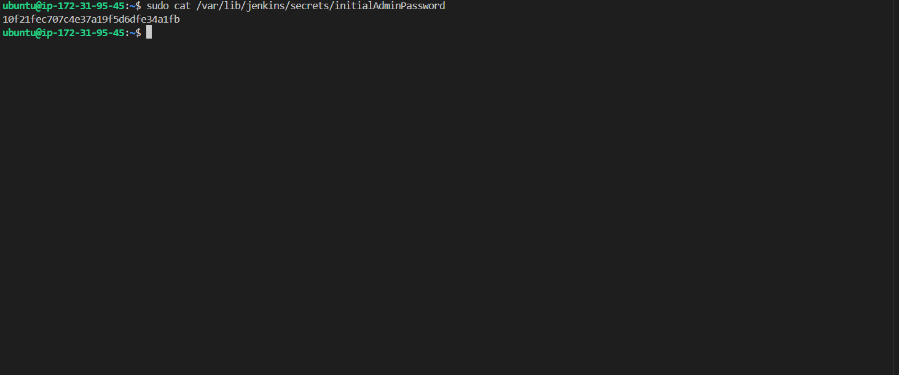

Paste it into the setup wizard.

Choose Install Suggested Plugins. 
    
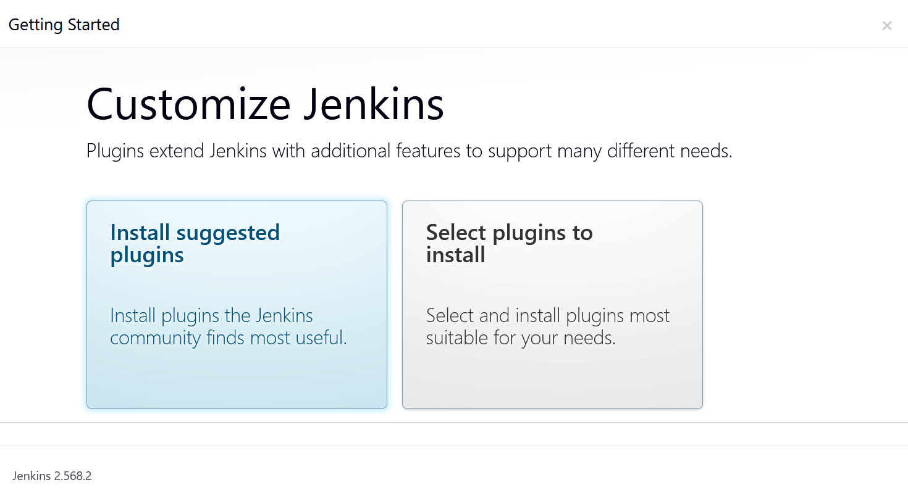

Create your first admin user:

Username: <your-username>

Password: <your-password>

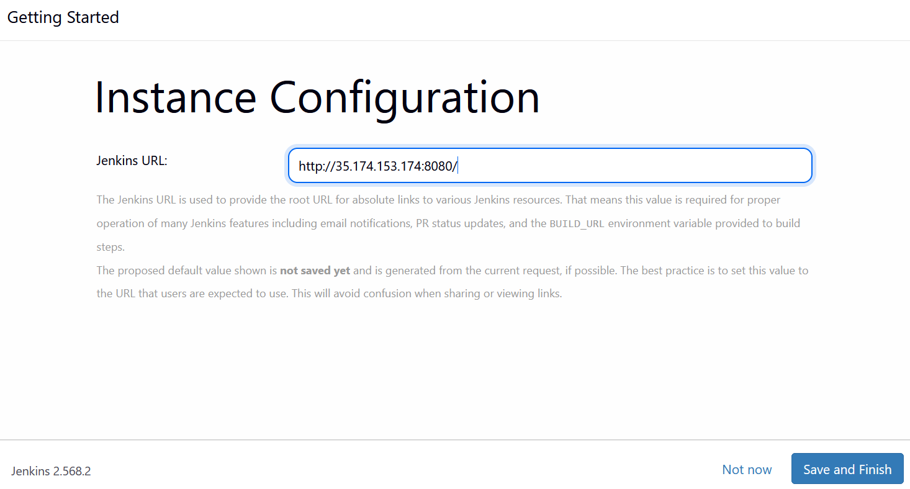

Confirm Jenkins URL:

http://35.174.153.174:8080/

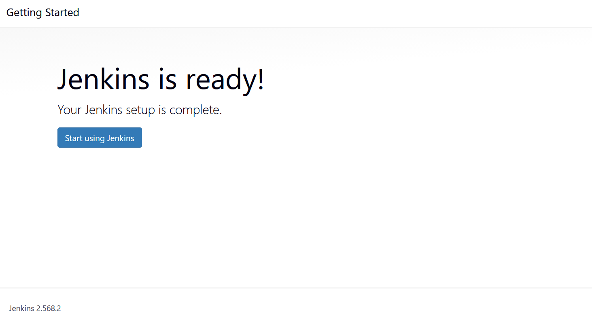

At this point, Jenkins installation is complete. 

## STEP 2 – Configure Jenkins to Retrieve Source Codes from GitHub using Webhooks

In this step, we will configure a Jenkins job to automatically retrieve source code from GitHub whenever new changes are pushed to the repository. This is an essential part of Continuous Integration (CI), where every code change is immediately built, tested, and made available to downstream processes.
Enable Webhooks in GitHub Repository

A webhook is an HTTP POST callback triggered by an event. In our case, every time a developer pushes code to GitHub, GitHub will notify Jenkins by sending a payload to a pre-defined URL.

Go to your GitHub repository → Settings → Webhooks → Add webhook. Make the following input

Payload URL: http://jenkins-public-ip:8080/github-webhook/

Content type: application/json

Events to trigger: Select "Just the push event".

Save the webhook. 

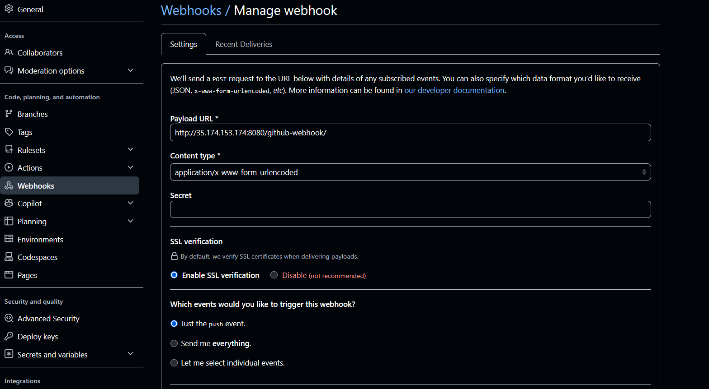
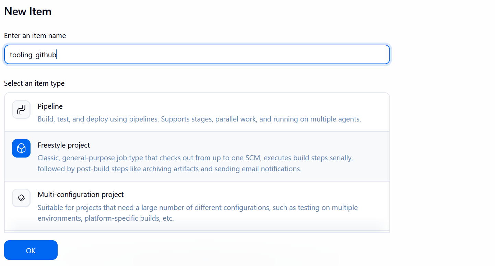 

Now GitHub will notify Jenkins whenever code is pushed.

### Create a Jenkins Freestyle Project

On the Jenkins web console: Click New Item → Select Freestyle Project → Name it tooling_github. 

* Under Source Code Management, select Git:

* Repository URL: https://github.com/omomotoly/tooling.git

* Credentials: Add GitHub credentials (username + personal access token, or Jenkins credentials manager).

**Example:**

```
Username: your-username
Password/Token: `<GitHub personal access token>`
```
Save configuration.

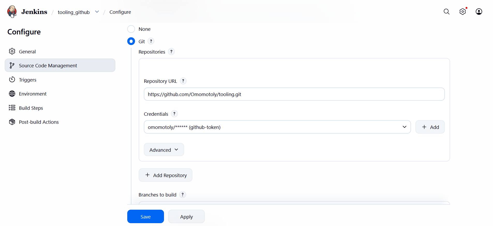

Ensure you install git on the Jenkins server

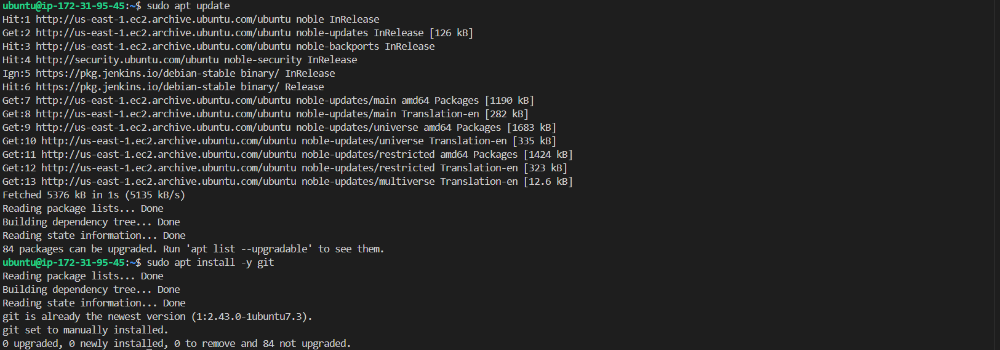

### Manual Build Verification

  * Click Build Now.
  * Open the build (e.g #1) → Console Output.

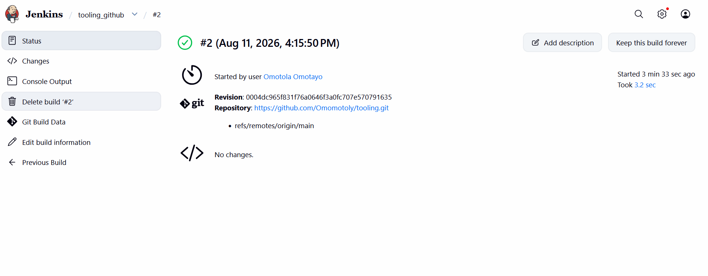 
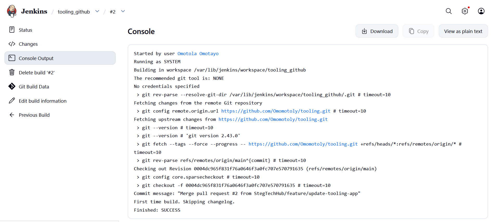 

You should see Jenkins pulling code from your GitHub repository successfully.

At this point, the job is manual only — we need to enable automation.
Enable Webhook Trigger

To make builds automatic: Open your tooling_github job → Configure. 

 Under Build Triggers: Select GitHub hook trigger for GITScm polling. 
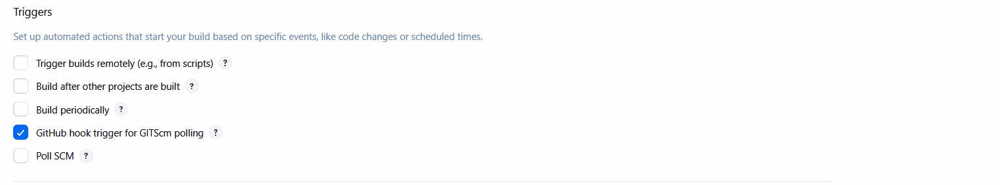

(Alternative: Use Poll SCM with a cron job, e.g. H/5 * * * *, but webhooks are faster).

Now, every push to GitHub will automatically trigger a Jenkins build.
Post-Build Actions – Archive Artifacts

Artifacts are the files produced by a build (e.g., source code, compiled binaries, reports). By default, Jenkins deletes workspace contents between builds, so archiving ensures outputs are preserved.

    In your job configuration, scroll to Post-build Actions.

    Select Archive the artifacts. 

    Enter file patterns, e.g.: **
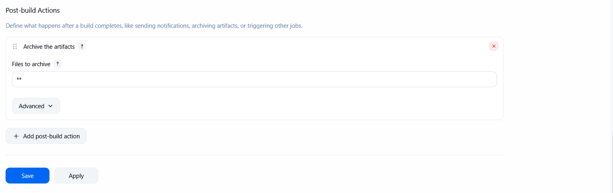

This archives all files from the workspace.
### Test End-to-End Automation

Edit any file in your GitHub repository, e.g. update README.md.

Push changes to main. 
    
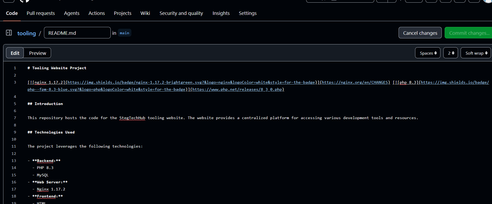

Observe Jenkins:
A new build starts automatically (triggered by webhook).
Console output confirms that Jenkins fetched changes.
Artifacts are archived for the build. 

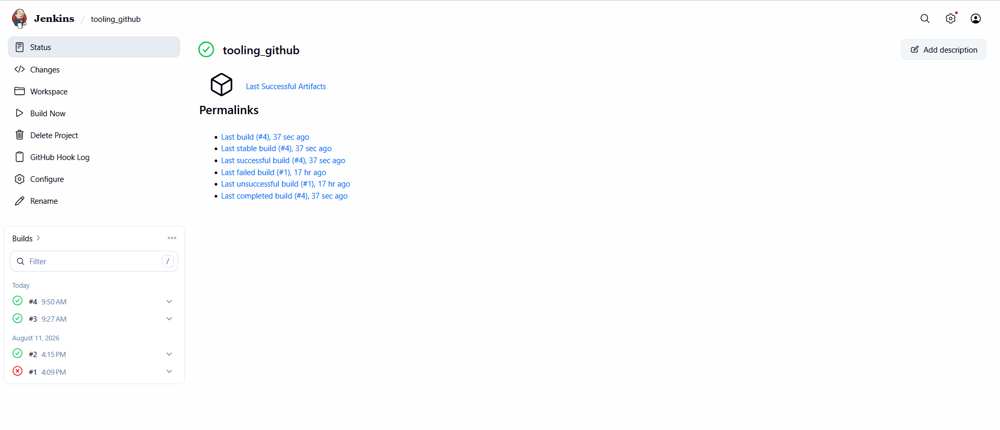

### Verify Artifact Storage

By default, Jenkins stores artifacts locally under:

ls /var/lib/jenkins/jobs/tooling_github/builds/<build_number>/archive/

Example: 
ls /var/lib/jenkins/jobs/tooling_github/builds/2/archive/
You should see the files from your GitHub repository archived here.
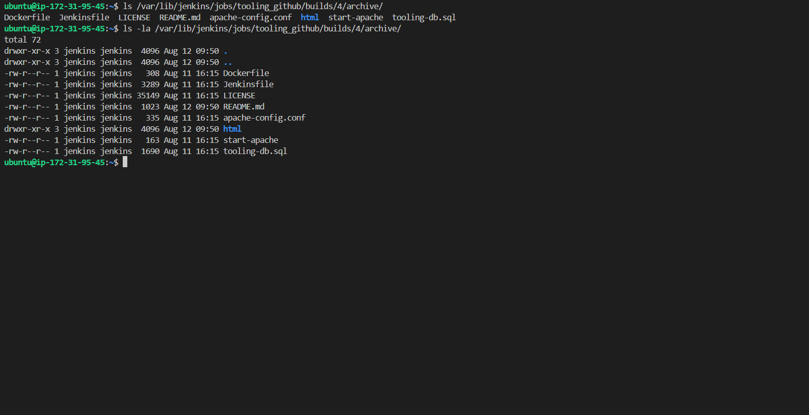

✅ Summary

At this stage, we have:

* Configured GitHub webhook → Jenkins job trigger.
* Ensured Jenkins automatically pulls code on each push.
* Archived artifacts for persistence.

This forms the foundation of our CI pipeline. Next, we’ll extend the pipeline to deploy the code to the NFS server and web servers.

## Step 3 — Configure Jenkins to Copy Files to NFS Server via SSH

Now that Jenkins is successfully building and storing artifacts locally, the next step is to transfer these artifacts to the NFS server where our web servers can access them under /mnt/apps. This ensures that every successful build is automatically deployed to the shared storage used by our application servers.

### Why SSH for Deployment?
Jenkins is highly extensible and supports 1400+ plugins to integrate with almost any system. For our use case, we leverage the Publish Over SSH plugin. This plugin allows Jenkins to securely copy build artifacts (or execute commands) on remote servers using SSH, which is both simple and reliable for deployment automation.

### Install Publish Over SSH Plugin
From the Jenkins main dashboard, navigate to Manage Jenkins > Manage Plugins.
On the Available tab, search for Publish Over SSH and install it. 

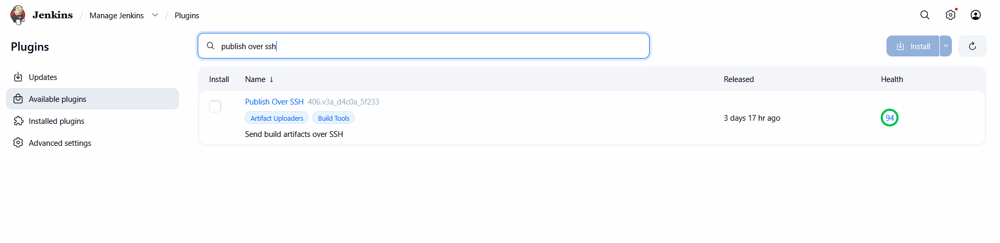 
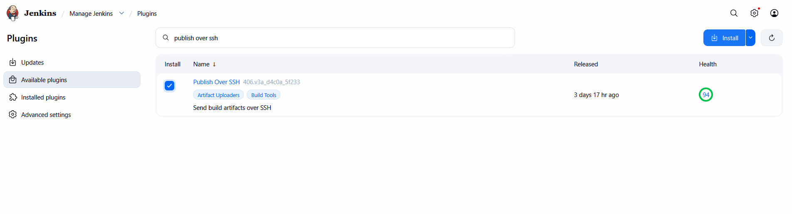
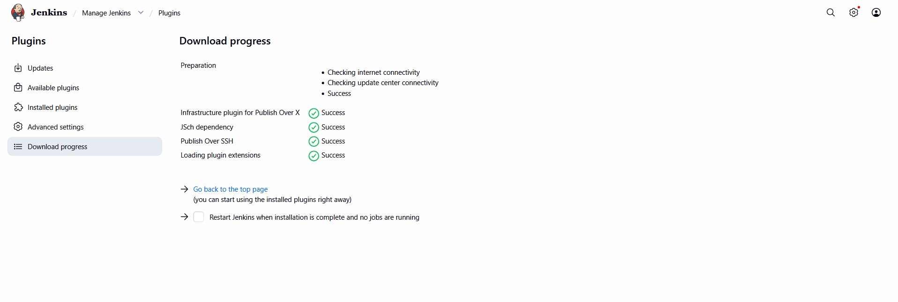

* Restart Jenkins if prompted.

### Configure Jenkins to Connect to NFS Server

Navigate to Manage Jenkins > Configure System. 

Scroll down to the Publish over SSH section.

Add a new SSH server configuration:

   * Key: Paste the private key contents (same .pem file used for manual SSH access)

   *  Name: (any descriptive name, e.g. nfs-server)

   * Hostname: Private IP of your NFS server (e.g. 172.31.23.26)


   * Remote Directory: /mnt/apps (this is the mount point shared with web servers)

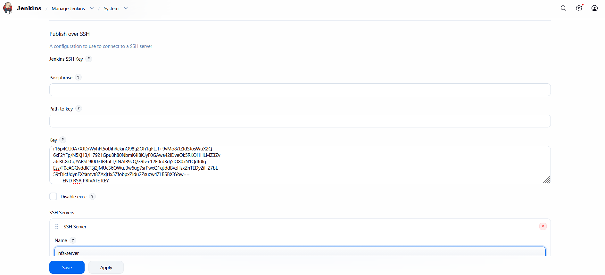 
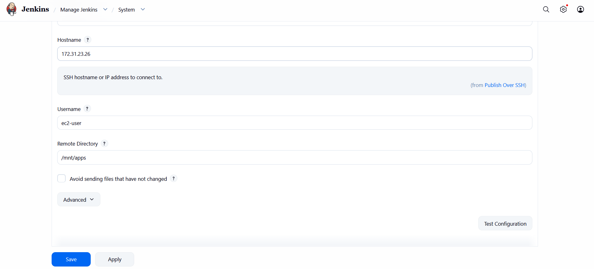


Click Test Configuration to verify connectivity. If successful, Jenkins can log in to the NFS server.. 

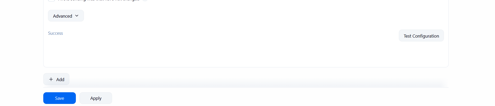

Note: Ensure TCP port 22 is open in the NFS server’s security group to allow SSH.

### Configure Jenkins Job to Copy Artifacts

Open your Jenkins job configuration page.
Scroll to Post-build Actions and select Send build artifacts over SSH.

Choose your configured SSH server (nfs-server).
In the Transfer Set, specify:
Source files: ** (this pattern copies all files and directories)
Remove prefix: (leave blank unless you want to strip a parent dir)
Remote directory: /mnt/apps

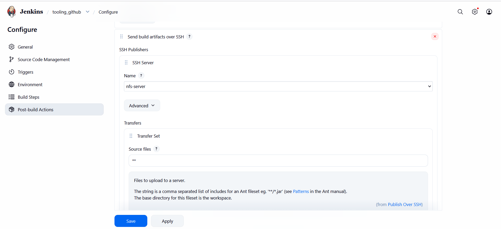

Save the configuration. 


### Test the Pipeline End-to-End

Commit a change to README.md in your GitHub repository.

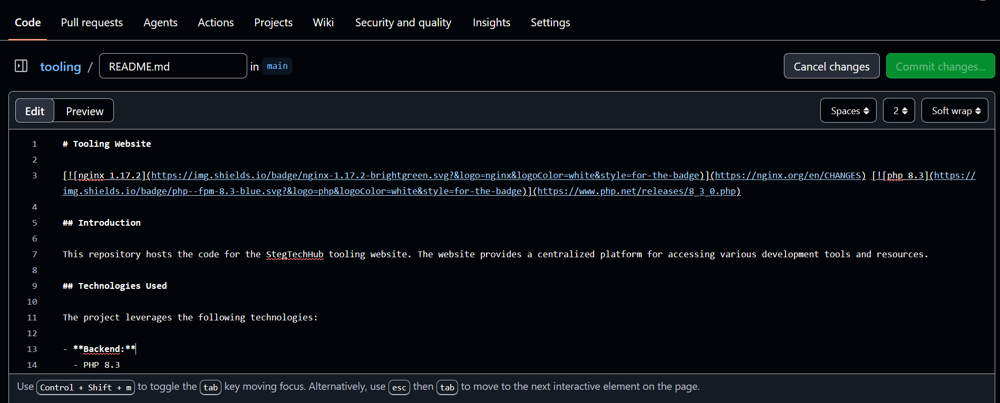
The GitHub webhook triggers Jenkins, which:
   - Pulls the updated code.
   - Builds artifacts locally.
   - Publishes files to the NFS server under /mnt/apps. 
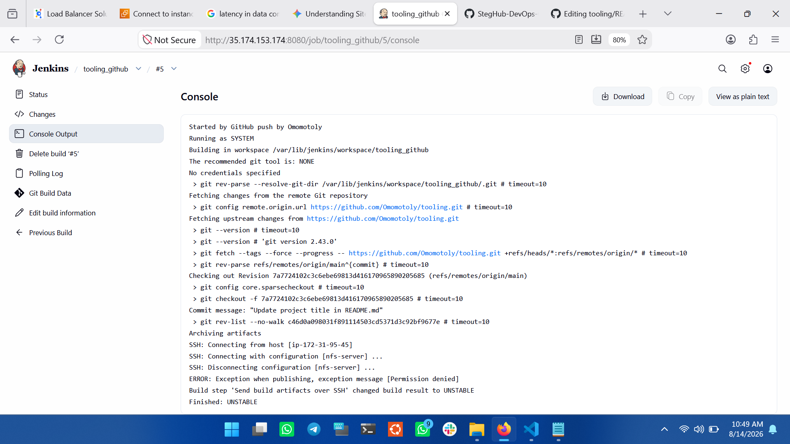

The build threw a no permission error. 

To allow your Jenkins user (or remote client) to write to /mnt on the NFS server, apply the following setup on the NFS server:

- Give ownership to ec2-user and make the directory writable:

```
sudo chown -R ec2-user:ec2-user /mnt/apps
```

- Grant read/write/execute permissions

```
sudo chmod -R 777 /mnt/apps
```
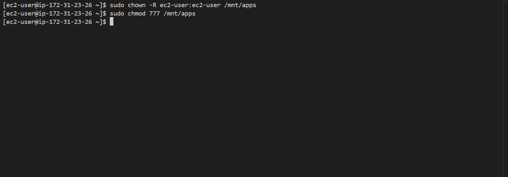

Edit the github tooling repository REAME.md again so that Webhook can trigger a new job


- SSH into the NFS server to confirm deployment:

```
ls -l /mnt/apps
```
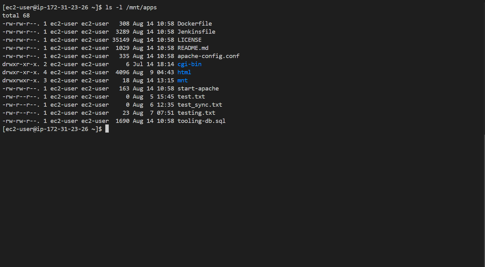

```
cat /mnt/apps/README.md
```
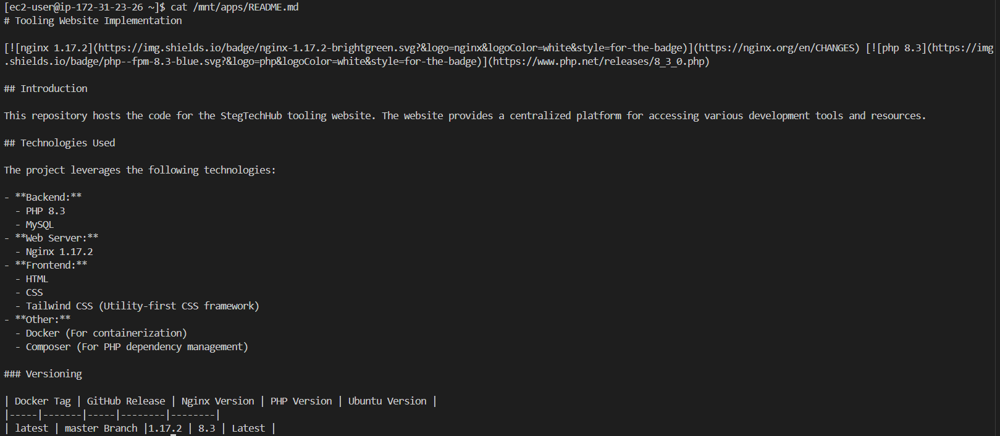 
If you see the updated content from GitHub, then deployment is working correctly. 


## Challenges Encountered
**Accidentally Adding Too Many SSH Action Blocks in Jenkins**

**The Problem**: While setting up the post-build step to send files over SSH, I accidentally clicked "Add" three times instead of once. I configured the first block properly to send all workspace files (**) to /mnt/apps on the NFS server, but left the other two blank blocks sitting there.

**Error Message in Console Output**: Exception when publishing, exception message [An SSH Transfer Set must not have an empty Source files and an empty Exec command - the transfer set should transfer files, execute a command or do both]
Build step 'Send build artifacts over SSH' changed build result to UNSTABLE
Finished: UNSTABLE
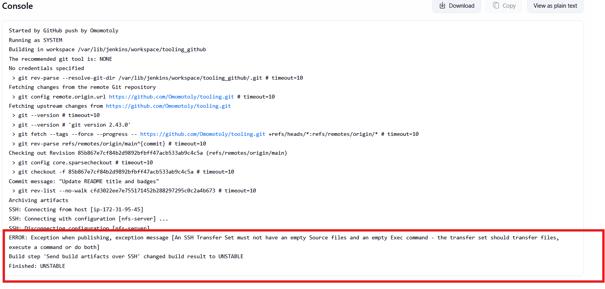

**Why It Broke**: Jenkins tried to process all three SSH blocks one after another. Because those extra two blocks had empty parameters, the build threw an exception and failed every time. I tried uninstalling the Publish Over SSH plugin to reset things, but Jenkins just put it in a "Pending Uninstall" state and kept the blank fields right where they were.

**How I Fixed It**: Rather than restarting the entire Jenkins server, I just filled out those two extra blocks with the exact same NFS settings. I pushed a quick update to README.md to trigger the GitHub webhook, and the build went through clean. Instead of shipping just 24 files, it actually copied 24+24+24 files across all three steps and finished with a green light.


**NFS Server Write Permission Denied During Artifact Transfer**
**The Problem**: When Jenkins attempted to publish build artifacts over SSH to the NFS target directory (/mnt/apps), the transfer failed with a Permission denied error because the directory was owned by root and restricted write access.

**How I Fixed It**: Changed directory ownership to the SSH user (ec2-user) and modified access permissions on the NFS host to allow full write operations.

**Commands Executed**:
```
sudo chown -R ec2-user:ec2-user /mnt/apps
sudo chmod -R 777 /mnt/apps
```
